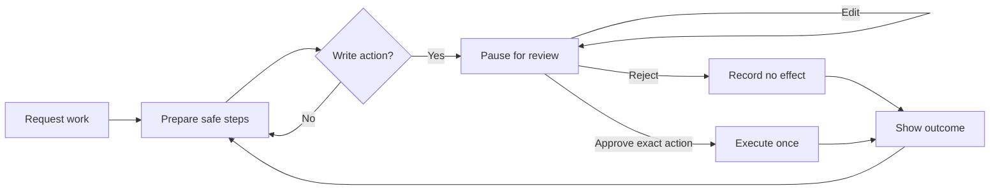

# Relay

**Relay is an approval-first operations desk for agentic work. It handles safe research and
preparation, then pauses before sending messages, creating events, placing purchase orders, or
changing records.**

[](https://github.com/ownasquare/human-in-the-loop-agent/actions/workflows/ci.yml)
[](https://www.python.org/)
[](https://github.com/ownasquare/human-in-the-loop-agent/blob/main/LICENSE)


The credential-free demo is deterministic and writes only to a local SQLite workspace. Live Claude,
search, email, and calendar connections are explicit opt-ins; a failed live connector never falls
back to fixture data.

> Relay is a local-first reference application, not a hosted service. It has no built-in user
> authentication. Keep it on loopback or behind authentication and authorization you operate.

## Run the guided demo

With [Docker](https://docs.docker.com/get-docker/) running:

```bash
docker compose up --build
```

Open [http://127.0.0.1:8000](http://127.0.0.1:8000), click **Start workflow**, then **Start
walkthrough**. No API key is needed.

If port 8000 is busy, run `RELAY_HOST_PORT=8012 docker compose up --build` and open port 8012.
Stop Relay with `docker compose down`; this preserves the local `relay-data` volume.

The walkthrough completes three safe reads, then pauses separately before it:

- creates a calendar event;
- sends an email;
- updates a customer record; and
- creates a local demo purchase order.

Each approval shows the exact change. After a decision, **What happened** shows the receipt and
readback before the workflow moves on.

## The core loop



Relay keeps planning and authority separate:

- server-owned policy decides which actions require approval;
- a decision is bound to one run, step, proposal version, payload hash, and interrupt;
- an edit creates a new proposal that must be reviewed again;
- execution uses a stable idempotency key and records a receipt plus readback; and
- an ambiguous post-submit failure becomes `outcome_unknown` instead of being retried blindly.

## Developer setup

Source development requires Python 3.11–3.13, [uv](https://docs.astral.sh/uv/), Node.js 22, npm,
and Make.

```bash
cp .env.example .env
make install
uv run relay demo reset
```

Start the API with `uv run relay serve`. In a second terminal, run `cd web && npm run dev`, then
open [http://127.0.0.1:5173](http://127.0.0.1:5173). The full setup, test rules, and safe tool
extension recipe are in [Contributing](https://github.com/ownasquare/human-in-the-loop-agent/blob/main/CONTRIBUTING.md).

The Python wheel and source distribution provide the Relay API and CLI only. The complete React
workspace is delivered by the GitHub source tree and the root Docker image.

## Connections

| Capability | Credential-free demo | Optional live boundary |
| --- | --- | --- |
| Planning | Fixed renewal plan | Anthropic via `ChatAnthropic` |
| Search | Bounded fixtures | Tavily |
| Email | Local demo outbox | Resend |
| Calendar | Local demo calendar | Google Calendar |
| Records | Seeded local customers | Application-owned adapter |
| Purchasing | Local demo purchase orders | No live connector ships by default |

Claude 3.5 Sonnet was retired by Anthropic on October 28, 2025. Relay keeps the model configurable
and currently defaults to `claude-sonnet-5`; see [Model compatibility](https://github.com/ownasquare/human-in-the-loop-agent/blob/main/docs/model-compatibility.md)
before changing it.

<details>
<summary><strong>Common developer commands</strong></summary>

```bash
uv run relay doctor          # Credential-safe readiness check
uv run relay serve           # Start the API
uv run relay demo reset      # Restore deterministic demo data
uv run relay graph           # Print the LangGraph as Mermaid
make check                   # Backend and frontend gates
make test-component          # Cypress component tests only
make test-e2e                # Playwright end-to-end tests only
make audit                   # Python and npm security audits
uv build                     # Python wheel and source distribution
```

Interactive OpenAPI docs are at `http://127.0.0.1:8000/docs` while the API is running.

</details>

## What local proof means

| Local proof | It does not prove |
| --- | --- |
| Planning, safe reads, pauses, decisions, resume, rejection, completion | Live Claude planning quality |
| SQLite records and LangGraph checkpoints survive restart | Multi-instance Postgres behavior |
| Demo writes happen only after approval | Real email, calendar, database, or purchase effects |
| Exact-action checks, idempotency, and audit chain | Production identity, authorization, or tenancy |
| Responsive local browser workflow | Hosted or public-network security |

## Documentation

| Guide | Start here when… |
| --- | --- |
| [Demo](https://github.com/ownasquare/human-in-the-loop-agent/blob/main/docs/demo.md) | You want the walkthrough, reset, or restart check |
| [Architecture](https://github.com/ownasquare/human-in-the-loop-agent/blob/main/docs/architecture.md) | You want the graph, persistence, and adapter map |
| [Safety model](https://github.com/ownasquare/human-in-the-loop-agent/blob/main/docs/safety.md) | You are changing approval or execution behavior |
| [API](https://github.com/ownasquare/human-in-the-loop-agent/blob/main/docs/api.md) | You are integrating with the versioned service |
| [Operations](https://github.com/ownasquare/human-in-the-loop-agent/blob/main/docs/operations.md) | You are configuring, backing up, or recovering Relay |
| [Contributing](https://github.com/ownasquare/human-in-the-loop-agent/blob/main/CONTRIBUTING.md) | You are developing or adding a tool |
| [Support](https://github.com/ownasquare/human-in-the-loop-agent/blob/main/SUPPORT.md) | You are troubleshooting or opening an issue |
| [Security](https://github.com/ownasquare/human-in-the-loop-agent/security/policy) | You need deployment cautions or private reporting rules |
| [Changelog](https://github.com/ownasquare/human-in-the-loop-agent/blob/main/CHANGELOG.md) | You want the release history |

Relay is available under the [MIT License](https://github.com/ownasquare/human-in-the-loop-agent/blob/main/LICENSE). Contributions follow the
[Code of Conduct](https://github.com/ownasquare/human-in-the-loop-agent/blob/main/CODE_OF_CONDUCT.md).
