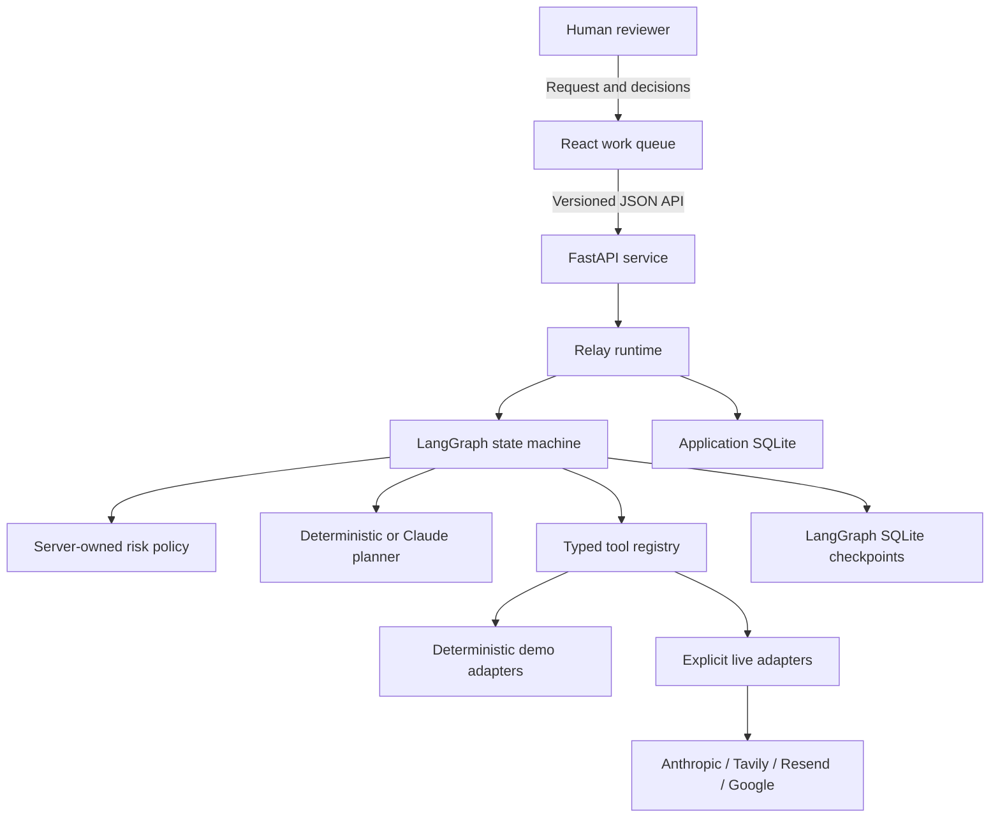
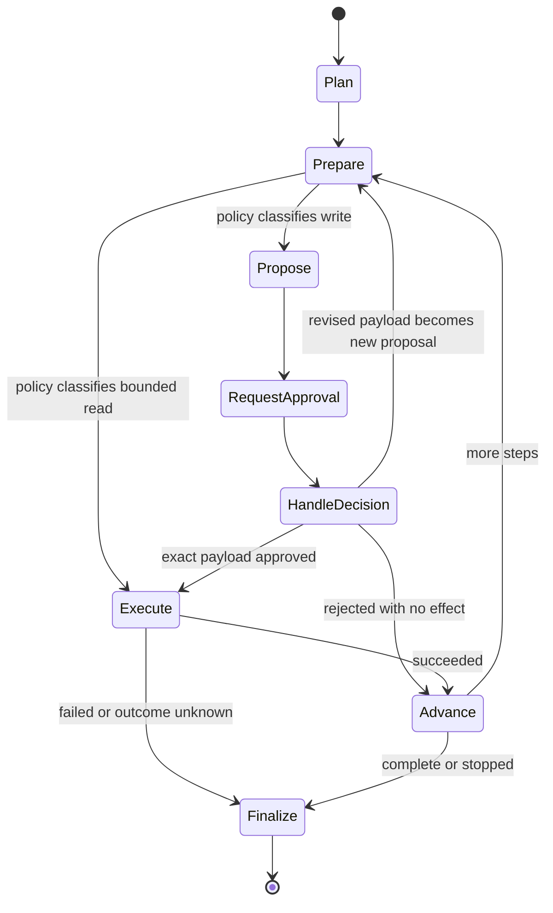
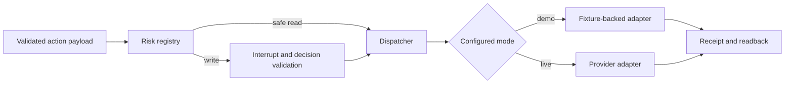

# Architecture

Relay is a local-first, approval-first operations desk. Its central architectural decision is that
planning and authorization are different capabilities: a model can describe an action, but only
server-owned policy plus a current human decision can authorize a write.

## System context



The browser never constructs a LangGraph `Command`, selects an executor, or decides whether a tool
requires review. It submits a validated domain decision to FastAPI. The runtime reloads the current
proposal and checkpoint, verifies all bindings, and then creates the exact resume command.

## Graph lifecycle



### Nodes

| Node | Responsibility | Side effects allowed |
| --- | --- | --- |
| `plan` | Produce a bounded, schema-valid sequence of actions | Model call in live planning mode only |
| `prepare` | Load the next durable step and route it through immutable tool policy | Step-state records only |
| `propose` | Canonicalize a write and create its durable review proposal | Proposal/audit records only |
| `request_approval` | Persist review metadata and call `interrupt()` | No tool/provider effect |
| `handle_decision` | Route approve, revise, or reject after durable validation | No external effect |
| `execute` | Dispatch the exact approved or safe-read action and persist receipt/readback | Yes, through the selected adapter |
| `advance` | Move to the next step or stop | No external effects |
| `finalize` | Produce the run result and terminal audit event | No external effects |

The request-approval node calls `interrupt()` once per proposal. A revision does not continue from
the old approval: it creates a new canonical payload, increments the proposal version, computes a
new hash, and returns to a new interrupt.

## State and identity

The typed graph state carries only workflow coordination data. Durable domain records remain in the
repository so API reads and audits do not depend on reconstructing arbitrary checkpoint internals.

Important identifiers are intentionally distinct:

| Identifier | Meaning |
| --- | --- |
| `run_id` | Public run identifier and LangGraph `configurable.thread_id` |
| `step_id` | Stable planned-step identity within a run |
| `proposal_id` | One reviewable version of an action payload |
| `proposal_version` | Monotonically increasing revision number |
| `payload_hash` | SHA-256 of canonical action JSON |
| `interrupt_id` | LangGraph interrupt that must receive the decision |
| `decision_id` | Immutable human decision record |
| `receipt_id` | Unique local execution outcome record |

An approval is valid only when its run, step, proposal, version, payload hash, and interrupt ID all
match the current pending proposal. The runtime resumes with
`Command(resume={interrupt_id: validated_decision})`; a scalar “approved” flag is insufficient.

## Persistence

Relay uses two persistence responsibilities under `RELAY_DATA_DIR`:

1. **Application repository** — runs, planned steps, proposals, decisions, execution receipts,
   audit events, and deterministic demo records.
2. **LangGraph checkpointer** — graph channel state, pending writes, interrupt metadata, and checkpoint
   history.

Both are file-backed SQLite for the local project. The graph compiles with `AsyncSqliteSaver` and
sync durability so an API response never claims a durable pause before its checkpoint write is
complete. The repository enables foreign keys, WAL, a busy timeout, parameterized statements, and
restrictive file permissions.

SQLite is not the production scaling claim. A multi-process or multi-host deployment should replace
both responsibilities with an appropriate production database/checkpointer and add distributed
run serialization.

### Application record flow

```text
run -> planned_step -> proposal -> decision -> execution_receipt
  \                         \                 \
   +-------------------------+-----------------+-> audit_event hash chain
```

Audit events include a hash of their redacted canonical content and the preceding event hash. This
makes later modification detectable; it does not make a database controlled by one administrator
immutable. Production deployments should export audit records to separately administered storage.

## Concurrency and resume

- The runtime holds one lock per `run_id`; concurrent decisions for one run are serialized.
- A consumed proposal cannot be decided again.
- A stale version/hash/interrupt combination returns a conflict without resuming the graph.
- Process restart is supported because both proposal state and graph checkpoints are file-backed.
- A run is always resumed with the same `run_id`/thread ID.
- Concurrent processes are outside the SQLite deployment contract; use a distributed lock and
  production checkpointer before horizontal scaling.

## Tool and adapter boundary

All actions are discriminated, typed payloads. The registry maps a known action type to one policy
entry and one adapter. Unknown action types fail closed.



Connector mode is server configuration, not an action argument. Demo mode never attempts a live
call. A live connector that is not ready fails closed; it never falls back to demo behavior.

### Read versus write tools

- Search, record reads, and availability reads are bounded read operations and may run without
  approval.
- Email send and calendar create allow approve, revise, or reject.
- Record update and purchase-order creation allow approve or reject; changing their payload requires
  a new proposal.
- A live purchase/payment connector is intentionally absent. The purchase tool writes a local demo
  purchase order only.

Database writes are typed operations such as “update this allowed field for this record with this
expected version,” not arbitrary model-authored SQL. The current read path permits one bounded
`SELECT` against allowlisted customer columns and enforces that boundary with lexical checks plus a
SQLite authorizer.

## Idempotency and uncertain outcomes

The executor derives a stable idempotency key from `run_id`, `step_id`, and proposal version (version
zero for safe reads). That identity remains stable across graph resume, HTTP retries, and process
restart. Before submission, the executor checks the local ledger:

- a successful prior receipt is returned without a second submission;
- a terminal rejection or validation failure is not submitted;
- an active execution is not started concurrently; and
- an `outcome_unknown` record blocks automatic retry.

Retries are permitted only for failures known to have happened before provider acceptance. A
timeout or disconnect after bytes may have reached a provider is not proof of failure. Relay records
`outcome_unknown`, preserves all non-secret correlation identifiers, and requires operator
reconciliation before any new attempt.

Provider receipts are followed by a readback when the provider supports it. A local “request sent”
message is not treated as delivery, calendar persistence, or production success.

## Planner boundary

Demo planning is deterministic and credential-free. Live planning uses
`ChatAnthropic.with_structured_output` and validates the result through the same server-owned action
schemas and risk policy as demo plans. Invalid, oversized, unknown, or policy-conflicting actions are
rejected before they can enter graph state.

The configured model defaults to `claude-sonnet-5`. No explicit sampling parameter or manual
thinking budget is set because the current model rejects those options. See
[model compatibility](model-compatibility.md).

## API boundary

FastAPI owns:

- request and response validation;
- mode/capability reporting;
- run start, list, and detail projections;
- pending approval review and decision submission;
- current-checkpoint binding and resume;
- stable error codes;
- audit read/export; and
- guarded deterministic demo reset.

The API returns domain views, not serialized LangGraph objects. Checkpoint IDs and payload hashes are
available as review/debug metadata, while the work plan and current decision remain the primary UI.
See [API](api.md) for the contract.

## Frontend architecture

The React application is a familiar operations workspace with two primary destinations and two
secondary reference surfaces:

- **Work** — start a workflow and revisit recent runs;
- **Approvals** — review exact proposed effects and before/after values;
- **History** — inspect the read-only audit trail across runs; and
- **Connections** — see configured/not-configured connector readiness.

Each run keeps **Plan and activity** focused on step progress, while **What happened** presents
confirmed receipts and readbacks in plain language.

TanStack Query owns server data, polling only active runs and reusing list/detail caches. Technical
IDs, hashes, checkpoint history, and raw payloads stay behind a details disclosure. The browser
handles stale and offline responses without implying that a write succeeded.

## Packaging

The root `Dockerfile` builds `web/dist`, installs the locked Python project, copies the frontend to
`RELAY_STATIC_DIR=/app/static`, and runs the service as an unprivileged user. Only `/app/data` is
writable/persistent in Compose. The container image serves the frontend and API on port 8000.

`web/Dockerfile` is a frontend-development image, not the production serving path. The production
artifact is the root image so the browser and API share one origin.

## Proof boundaries

| Claim | Required evidence |
| --- | --- |
| Source complete | Reviewed source, locked dependency install, static checks, and tests |
| Deterministic demo works | Local fixture-backed API/graph/browser workflow |
| Container works | Local image build, health/readiness, persistent restart, browser workflow |
| Live connector works | Explicit provider call plus provider receipt/readback for that connector |
| Hosted works | Deployed URL tested in its real network/runtime environment |
| Production ready | Authn/authz, tenant isolation, production storage, secrets, monitoring, backup, load, and incident-response proof |

Evidence from a lower row never implies a higher one.
