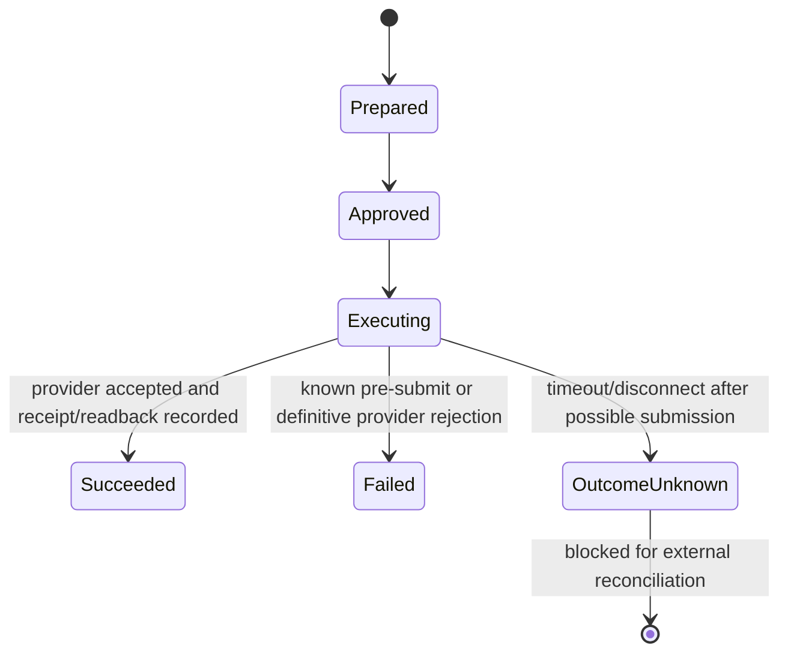

# Safety Model

Relay is designed to make the point of human control visible and enforceable. It does not assume
that model output is trustworthy, that a reviewer never makes mistakes, or that a provider response
always tells us whether a write happened.

## Safety objective

No irreversible or externally visible action may execute unless the server can prove that a human
decision authorizes the exact current payload, and no ambiguous submission may be retried as if it
were known to have failed.

## Approval invariants

These invariants are part of the runtime contract, not prompt guidance:

1. **Default deny.** Unknown tools and malformed action payloads do not execute.
2. **Server-owned policy.** Model output, search content, browser input, and connector responses
   cannot change a tool's risk class or allowed decisions.
3. **No effect during preparation.** Planning, canonicalization, proposal creation, and
   `interrupt()` perform no external side effect.
4. **Every write pauses.** Email send, calendar create, record update, and purchase-order creation
   require a current decision. Safe reads are bounded and separately registered.
5. **Exact payload binding.** The decision must match `run_id`, `proposal_id`, `proposal_version`,
   canonical `payload_hash`, step identity, and `interrupt_id`.
6. **Revision requires re-review.** An edit produces a new version and hash, expires the prior
   proposal, and interrupts again. It does not execute as an in-place modification.
7. **One decision per proposal.** A consumed, expired, stale, or superseded proposal cannot be
   approved again.
8. **Server-controlled resume.** The browser submits a domain decision; only the runtime builds
   `Command(resume={interrupt_id: decision})` for the stored thread.
9. **Exact executor dispatch.** The executor receives the approved repository payload, never a
   later model restatement or browser-supplied tool name.
10. **Idempotent execution identity.** One run/step/proposal-version idempotency key has at most one
    successful effect/receipt.
11. **Bounded retry.** Automatic retries stop at the provider submission boundary.
12. **Uncertainty is explicit.** Ambiguous post-submit failures become `outcome_unknown` and block
    automatic retry.
13. **Receipt plus readback.** Where possible, provider acceptance is followed by provider readback;
    model prose is never execution proof.
14. **Audit is append-oriented.** Redacted events are hash chained and retain proposal, decision,
    and outcome identities.
15. **Demo cannot escape.** Demo adapters use deterministic local fixtures and make no live calls.

## Canonical payload and hash

Before review, Relay serializes the validated discriminated action payload as canonical JSON:

- UTF-8;
- stable key ordering;
- no insignificant whitespace;
- normalized schema values; and
- no secret-bearing fields.

The displayed and approved `payload_hash` is SHA-256 over those bytes. The executor recomputes it
from the durable payload immediately before dispatch. A hash is a binding and tamper-detection
mechanism, not authorization by itself; all other identifiers and current state must also match.

## Action-specific review content

The review surface must show enough context for a meaningful decision:

| Action | Required review fields |
| --- | --- |
| Email | Configured sender identity, To/Cc, subject, complete body, step/proposal identity |
| Calendar | Calendar, summary, description, offset-aware start/end, attendees, notification behavior |
| Record update | Table and record identity, expected version, and every allowlisted field change |
| Purchase order | Vendor, amount, currency, and complete description |

These are the current action schemas; Relay does not imply support for Bcc, attachments, calendar
locations/conferencing, purchase line items, or billing/delivery fields. If a connector adds an
effective provider option, that option must become part of the validated, displayed, hashed payload
before the connector can use it.

The UI never relies on color alone. Reject is the initial focus in an approval dialog; approve is a
deliberate labelled action. Technical details remain available without obscuring the human-readable
effect.

## Decision semantics

- **Approve** authorizes the exact current payload.
- **Edit/revise** proposes replacement arguments, which the server validates and presents as a new
  approval. It is not an approval of the old payload.
- **Reject** records no external effect and adds reviewer feedback to the run.

Record updates and purchase orders do not accept the revise decision. Reject the proposal and start
new work when either payload must change; Relay never turns an edit into an immediate execution.

## Retry and idempotency states

Network retries are safe only while the adapter knows that submission did not begin, or when the
provider offers a documented idempotency mechanism that covers the complete request. A generic HTTP
timeout is not proof that a request was not accepted.

When status is `outcome_unknown`:

1. stop automatic execution for that run/step/proposal-version idempotency key;
2. preserve the local execution key, provider idempotency key, request/correlation ID, timestamps, and
   sanitized error class;
3. query provider readback or inspect the provider dashboard;
4. record reconciliation as found, absent, or still unknown in the operator's incident system; and
5. create separately authorized new work only when absence is established.

The current local reference app does not expose a reconciliation mutation or reopen a
`needs_attention` run. It deliberately leaves the uncertain run blocked so a missing browser
response cannot become an automatic retry.

## Threat model

### Prompt injection and untrusted content

Search results, model output, email text, calendar descriptions, record content, and provider error
messages can contain instructions. They are data, not authority. They cannot select an unregistered
tool, change connector mode, bypass review, or alter risk policy.

### Payload substitution and time-of-check/time-of-use

An attacker or stale browser may try to approve one payload while executing another. Durable
proposal identity, version, canonical hash, step ID, interrupt ID, and an immediate pre-dispatch
recheck prevent this class of substitution.

### Replay and duplicate submission

Concurrent clicks, HTTP retries, process restarts, and graph replay can repeat an executor path. A
per-run lock, consumed-decision check, and durable execution-key ledger prevent duplicate local
submission. Live adapters must also use provider idempotency or reconciliation when available.

### Confused deputy and cross-run access

The browser never provides a tool implementation or checkpoint namespace. The API loads resources
by validated identifier and must enforce reviewer/tenant ownership before any shared deployment.
The local project is single-user and does not claim this production boundary.

### Secret leakage

Secrets are server configuration. They are excluded from action schemas and redacted from logs,
errors, checkpoints, audit events, exports, and readiness responses. Diagnostics report key names
and boolean readiness only.

### Malicious or compromised checkpoint data

Checkpoint storage should use strict LangGraph message-pack deserialization or an explicit module
allowlist. Treat a compromised local database as a security incident; hash chaining detects some
application-record tampering but is not a sandbox.

### Database query risk

The current read tool accepts one bounded `SELECT` against allowlisted customer columns. It rejects
multiple statements and write keywords, rewrites the public table name to the demo table, and uses
SQLite's authorizer to deny other tables, columns, and mutations. Write tools are typed domain
operations with expected-version checks; Relay does not expose model-authored SQL as a write tool.

## Reviewer and operator responsibilities

A reviewer should verify recipients, attendees, timezones, before/after record values, totals,
currency, and external links. Approval should be rejected when context is incomplete. Operators
must use provider credentials limited to the exact connector action and must reconcile uncertain
outcomes before retrying.

Approval is not a substitute for:

- authentication and role-based authorization;
- separation of duties for high-value actions;
- provider-side spending/sending limits;
- legal, privacy, or records-retention review;
- anti-abuse controls and rate limits; or
- incident response and recovery.

## Local deployment limitations

- The service is unauthenticated and intended for loopback.
- SQLite supports the single-instance local project, not horizontal production scale.
- The demo uses fixtures and local outbox/calendar/order tables.
- A local purchase order is not a payment or supplier submission.
- A provider HTTP success may not prove delivery to a recipient or attendee.
- The audit chain is detectable history, not independent immutable storage.

See [Operations](operations.md) for recovery and [Security](../SECURITY.md) for private reporting.
